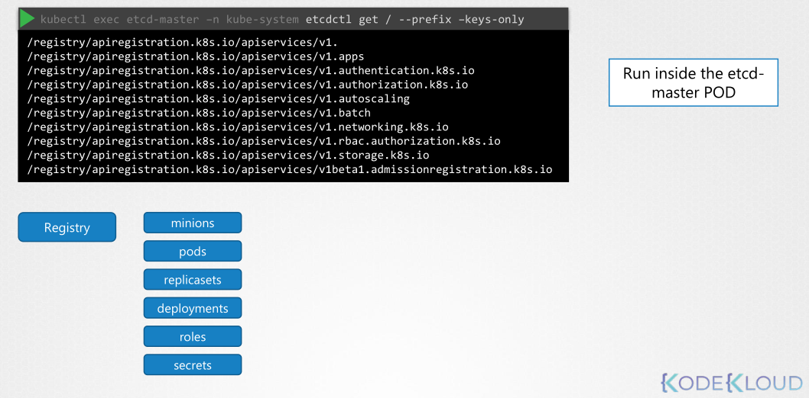
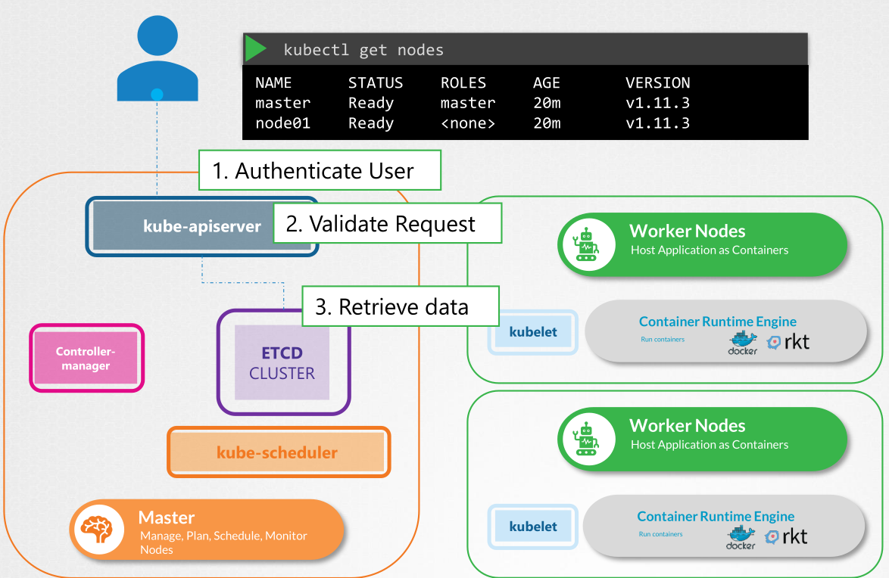
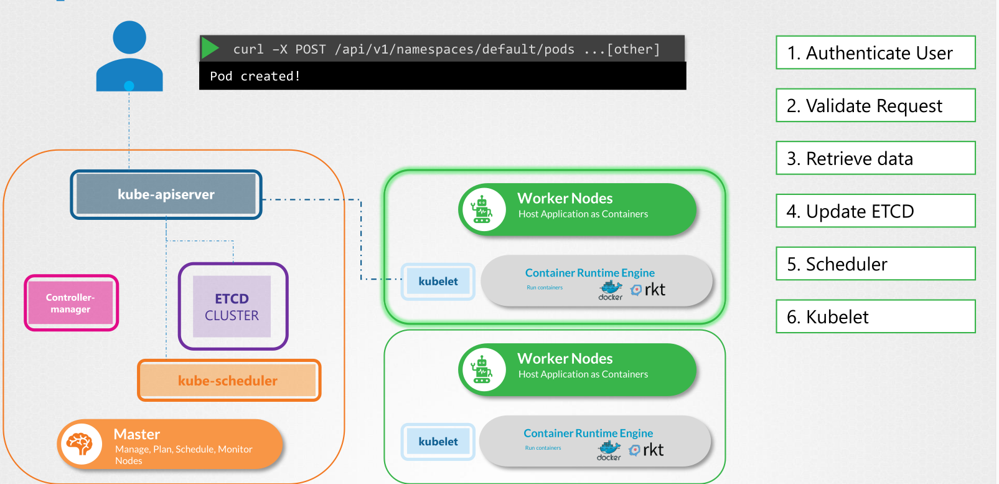

## ETCD

1. Etcd is a distributed reliable key-value store that is simple, secure, and fast.
2. Key-value store (document DB, jasn-yaml-like structure)
    - set a key value pair in etcd:
    ```sh
    etcdctl set key value
    ```
3. Every info (eg. Nodes, pods, configs, secrets) are stored in ETCD cluster.
4. k8s stored structure:  


## Kube-API server

1. how `get node` work?



2. how `create pod` work?



## Kube controller Manager

1. Continueously watch the status.
2. take necessary action to remediate the situation.

remediate: *to correct something that is wrong or damaged or to improve a bad situation.*