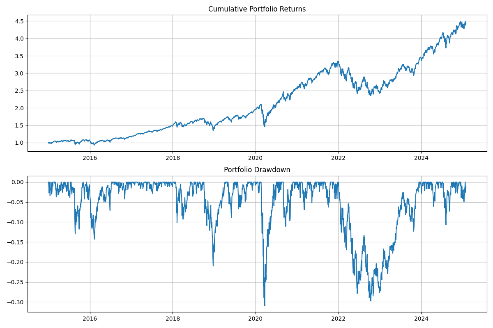
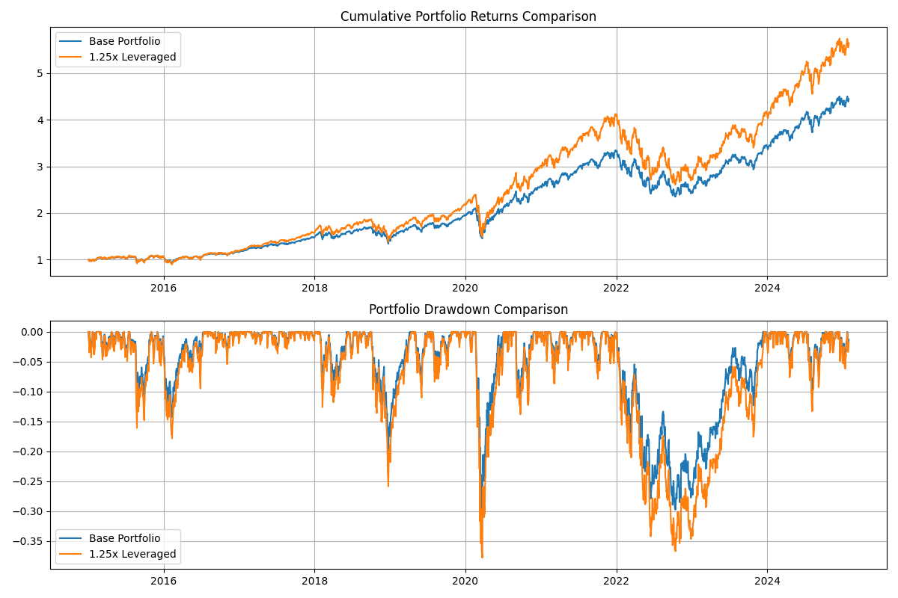

## With carefulness, leverage ETFs boosts returns

Leveraged ETFs can amplify investment returns when used strategically. While higher leverage ratios (2x or 3x) can be risky, a modest 1.25x leverage offers a balanced approach to enhance returns while managing risk.

## ETFs choice

For our analysis, we selected two major market-tracking ETFs that offer broad market exposure and high liquidity. The combination of S&P 500 (VOO) and NASDAQ 100 (QQQ) provides diversification across both traditional blue-chip stocks and technology-focused growth companies.



## Leverage boost performance



Our analysis compares a base portfolio of VOO (50%) and QQQ (50%) with a 1.25x leveraged version, assuming a 3% borrowing cost. The results reveal interesting insights about the risk-return tradeoff of modest leverage:

### Returns Enhancement
- Total return increased significantly from 344.20% to 463.81%
- Annual return improved from 15.98% to 18.76%, representing a 17.8% increase
- The power of leverage is evident in the cumulative returns chart, showing consistent outperformance

### Risk Considerations
- Annual volatility rose proportionally from 19.43% to 24.29%
- Maximum drawdown deepened from -31.00% to -37.79%
- Market sensitivity (Beta) increased from 1.07 to 1.33
- Risk metrics (VaR 95% and CVaR 95%) showed moderately higher downside risk

### Risk-Adjusted Performance
- Sharpe Ratio remained virtually unchanged (0.7066 vs 0.7061)
- Sortino Ratio showed slight improvement (0.876 vs 0.875)
- Information Ratio decreased from 3.07 to 2.02
- Calmar Ratio experienced minimal decline (0.515 to 0.496)

## Finding Appropriate Leverage Methods

Selecting the right leverage method is crucial for portfolio management. Here are the main approaches to obtaining leverage:

1. **Margin Accounts**
   - Use your existing portfolio as collateral
   - Typically offers competitive interest rates
   - Provides flexibility in leverage amount
   - Subject to margin calls during market downturns

2. **Securities-Based Lines of Credit (SBLOC)**
   - Uses your investment portfolio as collateral
   - Often offers lower interest rates than margin accounts
   - No set repayment schedule
   - More stable than margin accounts during market volatility

3. **Home Equity Lines of Credit (HELOC)**
   - Uses home equity as collateral
   - Generally offers lower interest rates than unsecured loans
   - Tax-deductible interest in some jurisdictions
   - Longer repayment terms available

4. **Leveraged ETFs and ETNs**
   - Built-in leverage without borrowing
   - No margin calls
   - Daily rebalancing may cause tracking error
   - Available in various leverage ratios (2x, 3x)

5. **Options Strategies**
   - LEAPS (Long-term Equity AnticiPation Securities)
   - Deep-in-the-money calls
   - Synthetic long positions
   - Requires options knowledge and monitoring

6. **Futures Contracts**
   - High leverage potential
   - Standardized contracts
   - Lower transaction costs
   - Requires futures market expertise

7. **Portfolio Loans**
   - Available through some brokers and banks
   - Can use multiple asset types as collateral
   - Flexible terms and usage
   - May offer better rates than traditional loans

8. **Box Spreads Financing**
   - Advanced options strategy for borrowing
   - Often provides very competitive rates
   - Requires options approval level
   - Limited to certain account types

Key Considerations When Choosing a Method:
- Interest rates and borrowing costs
- Flexibility needs
- Risk tolerance
- Tax implications
- Market conditions
- Personal expertise level
- Account requirements
- Maintenance and monitoring needs

Each method has unique advantages and risks. It's often beneficial to:
1. Start with simpler methods
2. Understand all associated costs
3. Have a clear risk management plan
4. Consider using multiple methods to diversify risk
5. Regular review and rebalancing as needed

## Conclusions

Our analysis demonstrates that modest leverage (1.25x) in ETF investing can be an effective tool for enhancing portfolio returns when implemented thoughtfully. Key takeaways include:

1. **Performance Enhancement**
   - The 1.25x leveraged portfolio achieved significantly higher total returns (463.81% vs 344.20%)
   - Annual returns improved by 17.8% while maintaining similar risk-adjusted metrics
   - The benefits of leverage were consistent across different market conditions

2. **Risk Management**
   - Moderate leverage resulted in proportional increase in volatility
   - Risk metrics remained manageable with 1.25x leverage
   - The Sharpe and Sortino ratios stayed nearly unchanged, indicating efficient risk-adjusted returns

3. **Implementation Strategy**
   - Multiple leverage methods are available, each with distinct advantages
   - The choice of leverage method should align with individual circumstances
   - Regular monitoring and rebalancing are essential
   - Starting with conservative leverage ratios is recommended

4. **Best Practices**
   - Maintain adequate risk controls
   - Diversify leverage sources when possible
   - Keep borrowing costs low
   - Have a clear exit strategy
   - Regular portfolio review and rebalancing

While leverage can amplify returns, it requires careful consideration, proper risk management, and ongoing monitoring. For investors willing to accept additional complexity and risk, modest leverage can be a valuable tool in portfolio management.

## Appendix

### A.1 Code for backtracking Leveraged Portfolio

```python
import yfinance as yf
import pandas as pd
import numpy as np
from datetime import datetime, timedelta
import matplotlib.pyplot as plt
from scipy import stats

def fetch_data(tickers, start_date, end_date):
    """Fetch historical data for given tickers"""
    data = pd.DataFrame()
    for ticker in tickers:
        df = yf.download(ticker, start=start_date, end=end_date)['Adj Close']
        data[ticker] = df
    return data

def calculate_portfolio_returns(data, weights):
    """Calculate portfolio returns based on given weights"""
    # Calculate daily returns
    returns = data.pct_change()
    
    # Calculate portfolio returns
    portfolio_returns = (returns * weights).sum(axis=1)
    return portfolio_returns

def calculate_leveraged_returns(returns, leverage=1.25, borrowing_cost_annual=0.03):
    """Calculate leveraged returns with borrowing costs"""
    # Convert annual borrowing cost to daily
    daily_borrowing_cost = (1 + borrowing_cost_annual) ** (1/252) - 1
    
    # Calculate leveraged returns with borrowing cost
    leveraged_returns = returns * leverage - (leverage - 1) * daily_borrowing_cost
    return leveraged_returns

def calculate_metrics(returns, risk_free_rate=0.03):
    """Calculate various performance metrics"""
    metrics = {}
    
    # Convert to numpy array and remove NaN
    returns_clean = returns.dropna()
    
    # Basic metrics
    metrics['Total Return'] = (1 + returns_clean).prod() - 1
    metrics['Annual Return'] = (1 + returns_clean).prod() ** (252/len(returns_clean)) - 1
    metrics['Daily Volatility'] = returns_clean.std()
    metrics['Annual Volatility'] = returns_clean.std() * np.sqrt(252)
    
    # Sharpe Ratio
    excess_returns = returns_clean - risk_free_rate/252
    metrics['Sharpe Ratio'] = np.sqrt(252) * excess_returns.mean() / returns_clean.std()
    
    # Sortino Ratio
    downside_returns = returns_clean[returns_clean < 0]
    downside_std = downside_returns.std()
    metrics['Sortino Ratio'] = np.sqrt(252) * excess_returns.mean() / downside_std
    
    # Maximum Drawdown
    cum_returns = (1 + returns_clean).cumprod()
    rolling_max = cum_returns.expanding().max()
    drawdowns = cum_returns/rolling_max - 1
    metrics['Maximum Drawdown'] = drawdowns.min()
    
    # Calmar Ratio
    metrics['Calmar Ratio'] = metrics['Annual Return'] / abs(metrics['Maximum Drawdown'])
    
    # Value at Risk (VaR) - 95% confidence
    metrics['VaR 95%'] = np.percentile(returns_clean, 5)
    
    # Conditional VaR (CVaR/Expected Shortfall)
    metrics['CVaR 95%'] = returns_clean[returns_clean <= metrics['VaR 95%']].mean()
    
    # Beta (using S&P 500 as market proxy)
    sp500 = yf.download('^GSPC', start=returns_clean.index[0], end=returns_clean.index[-1])['Adj Close'].pct_change()
    # Align dates between portfolio returns and market returns
    aligned_data = pd.concat([returns_clean, sp500], axis=1).dropna()
    slope, _, r_value, _, _ = stats.linregress(aligned_data.iloc[:, 1], aligned_data.iloc[:, 0])
    metrics['Beta'] = slope
    metrics['R-squared'] = r_value ** 2
    
    # Information Ratio
    tracking_error = (returns_clean - aligned_data.iloc[:, 1]).std() * np.sqrt(252)
    metrics['Information Ratio'] = (metrics['Annual Return'] - 0.03) / tracking_error
    
    # Kurtosis and Skewness
    metrics['Kurtosis'] = returns_clean.kurtosis()
    metrics['Skewness'] = returns_clean.skew()
    
    return metrics

def plot_portfolio_performance(returns):
    """Plot cumulative returns and drawdown"""
    cumulative_returns = (1 + returns).cumprod()
    
    plt.figure(figsize=(12, 8))
    
    # Plot cumulative returns
    plt.subplot(2, 1, 1)
    plt.plot(cumulative_returns.index, cumulative_returns.values)
    plt.title('Cumulative Portfolio Returns')
    plt.grid(True)
    
    # Plot drawdown
    plt.subplot(2, 1, 2)
    rolling_max = cumulative_returns.expanding().max()
    drawdowns = cumulative_returns/rolling_max - 1
    plt.plot(drawdowns.index, drawdowns.values)
    plt.title('Portfolio Drawdown')
    plt.grid(True)
    
    plt.tight_layout()
    plt.savefig('portfolio_performance.png')
    plt.close()

def main():
    # Set parameters
    tickers = ['VOO', 'QQQ']
    weights = [0.5, 0.5]
    start_date = '2015-01-01'
    end_date = datetime.now().strftime('%Y-%m-%d')
    
    # Fetch data
    print("Fetching data...")
    data = fetch_data(tickers, start_date, end_date)
    
    # Calculate portfolio returns
    print("\nCalculating portfolio returns...")
    portfolio_returns = calculate_portfolio_returns(data, weights)
    
    # Calculate leveraged portfolio returns
    leveraged_returns = calculate_leveraged_returns(portfolio_returns)
    
    # Calculate metrics for both portfolios
    print("\nCalculating performance metrics...")
    metrics_base = calculate_metrics(portfolio_returns)
    metrics_leveraged = calculate_metrics(leveraged_returns)
    
    # Print metrics comparison
    print("\nPortfolio Performance Metrics Comparison:")
    print("-" * 70)
    print(f"{'Metric':<25} {'Base Portfolio':>20} {'1.25x Leveraged':>20}")
    print("-" * 70)
    for metric in metrics_base.keys():
        base_value = metrics_base[metric]
        lev_value = metrics_leveraged[metric]
        print(f"{metric:<25} {base_value:>20.4f} {lev_value:>20.4f}")
    
    # Plot performance comparison
    print("\nGenerating performance plots...")
    plt.figure(figsize=(12, 8))
    
    # Plot cumulative returns comparison
    plt.subplot(2, 1, 1)
    cum_returns_base = (1 + portfolio_returns).cumprod()
    cum_returns_lev = (1 + leveraged_returns).cumprod()
    plt.plot(cum_returns_base.index, cum_returns_base.values, label='Base Portfolio')
    plt.plot(cum_returns_lev.index, cum_returns_lev.values, label='1.25x Leveraged')
    plt.title('Cumulative Portfolio Returns Comparison')
    plt.grid(True)
    plt.legend()
    
    # Plot drawdown comparison
    plt.subplot(2, 1, 2)
    rolling_max_base = cum_returns_base.expanding().max()
    rolling_max_lev = cum_returns_lev.expanding().max()
    drawdowns_base = cum_returns_base/rolling_max_base - 1
    drawdowns_lev = cum_returns_lev/rolling_max_lev - 1
    plt.plot(drawdowns_base.index, drawdowns_base.values, label='Base Portfolio')
    plt.plot(drawdowns_lev.index, drawdowns_lev.values, label='1.25x Leveraged')
    plt.title('Portfolio Drawdown Comparison')
    plt.grid(True)
    plt.legend()
    
    plt.tight_layout()
    plt.savefig('portfolio_performance_comparison.png')
    plt.close()

if __name__ == "__main__":
    main()
```