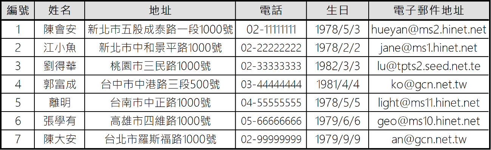
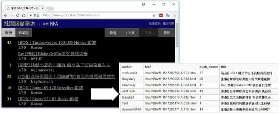
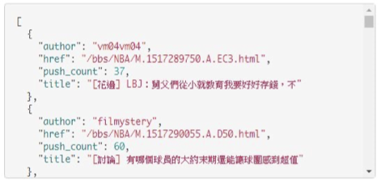
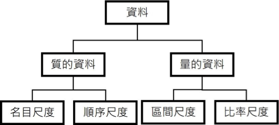
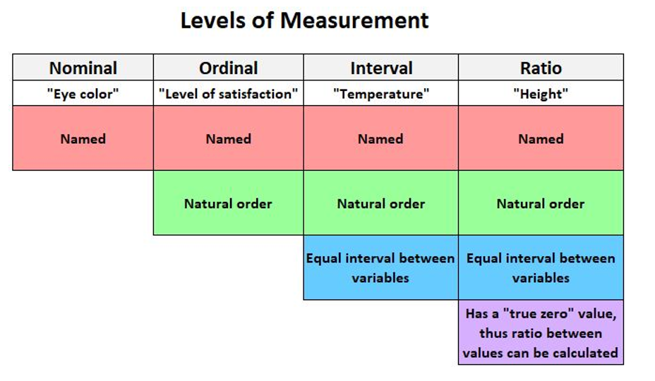
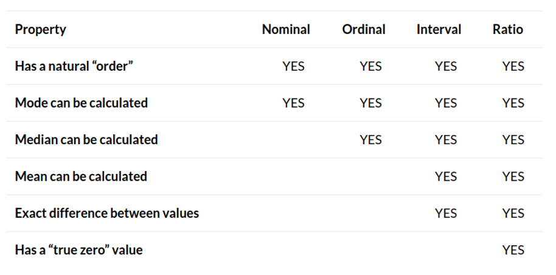
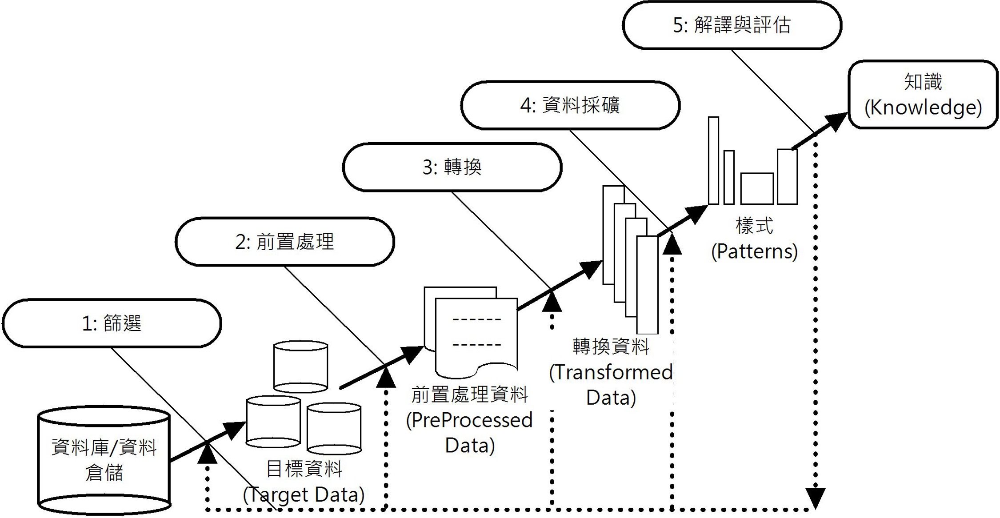
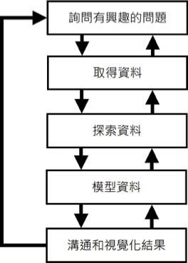

本筆記來自資工系資料科學導論課程，第一章！

## Foundations of Data Science

- 資料科學是一個完整過程的研究方法，包括蒐集資料、觀察資料、探索資料和提出假設，然後驗證結果（使用統計或數學方法）。
- 資料科學使用的資料不是原始資料（Raw Data），而是一種有意義的資料，稱為資訊（Information），知識就是連接的資訊。

## Types of data

### Structured, Unstructured

1. Structured data
   
2. Unstructured data: need **data cleaning** to make it structured
   
3. half-structured data: eg. json
   

### 質的資料與量的資料 (Qualitative and Quantitative Data)

1. 質的資料（Qualitative Data）
   - 名目尺度（Nominal Data）
     - 用來區分不同類別的資料，但沒有順序之分。
     - eg. 性別、國籍、學校名稱
   - 順序尺度（Ordinal Data）
     - 有順序之分，但沒有固定的間隔。
     - eg. 學生的成績、學生的年級，例如：快樂程度 5 高於 1；滿意度 8 小於 10 等。
2. 量的資料（Quantitative Data）
   - 間隔尺度（Interval Data）
     - 有固定的間隔，但沒有絕對零點。
     - eg. 溫度、時間
   - 比例尺度（Ratio Data） - 有固定的間隔，且有絕對零點。 - eg. 身高、體重、年齡
     
     

## Five Steps of Data Science

- 「資料採礦」（Data Mining）：find pattern（樣式），是使用軟體技術分析資料庫儲存的龐大資料，以便從這些資料中找出隱藏的規則性或因果關係。
- Goals of Data Mining:
  - Prediction
    - Predict based on possesed data. eg. Predict the stock price.
  - Identification
    - eg. Identify spam email by finding the pattern.
  - Classification
    - eg. Classify the types of user, and send ads accordingly.
  - Optimization
    - eg. 便利商店因為賣場面積有限，只能銷售 1000 種商品，我們需要最佳化商品的選擇、選購動線設計和商品排列的架位，以便創造最大的營業額。

### Data Mining steps (KDD steps)

從原始資料（Raw Data）開始，經過多個步驟的處理後，直到從資料探索出知識為止。這個過程稱為知識發現（Knowledge Discovery in Databases, KDD）。

### Data Mining Process

資料科學和資料分析（Data Analytics）最大差異在於資料科學必須遵循結構化步驟。

1. Define the problem (ask an interesting question)
2. Collect the data：取得所有與問題相關的原始資料（Raw Data）
3. Explore the data：進一步整理、歸納和描述資料，以便進行資料分析（Data Analysis）。
4. Model the data：comfirm previous assumptions，使用統計和機器學習模型來驗證提出的假設
5. Communicate and visualize the results：使用圖表等視覺化方式來呈現結果。

**test** : 考情境判斷，判斷情況是哪種資料採礦的步驟。
